#+title: Dynamic Branch Prediction with Perceptrons
#+subtitle: FA23
#+date:
#+author: =@nebu=
#+BEAMER_THEME: sigarch
# #+options: toc:nil
#+latex_class_options: [aspectratio=169, 12pt]
#+LATEX_HEADER:\usepackage{tcolorbox}
#+LATEX_HEADER: \usepackage{forest}
#+LATEX_HEADER:\usepackage{etoolbox}
#+LATEX_HEADER:\BeforeBeginEnvironment{minted}{\begin{tcolorbox}[colback=black,colframe=black]}%
#+LATEX_HEADER:\AfterEndEnvironment{minted}{\end{tcolorbox}}%
#+LATEX_HEADER:\usemintedstyle{native}
#+options: H:2

#+LATEX_HEADER:% Add support for \subsubsectionpage
#+LATEX_HEADER:\def\subsubsectionname{\translate{Subsubsection}}
#+LATEX_HEADER:\def\insertsubsubsectionnumber{\arabic{subsubsection}}
#+LATEX_HEADER:\setbeamertemplate{subsubsection page}
#+LATEX_HEADER:{
#+LATEX_HEADER:\begin{centering}
#+LATEX_HEADER:{\usebeamerfont{subsubsection name}\usebeamercolor[fg]{subsubsection name}\subsubsectionname~\insertsubsubsectionnumber}
#+LATEX_HEADER:\vskip1em\par
#+LATEX_HEADER:\begin{beamercolorbox}[sep=4pt,center]{part title}
#+LATEX_HEADER:\usebeamerfont{subsubsection title}\insertsubsubsection\par
#+LATEX_HEADER:\end{beamercolorbox}
#+LATEX_HEADER:\end{centering}
#+LATEX_HEADER:}
#+LATEX_HEADER:\def\subsubsectionpage{\usebeamertemplate*{subsubsection page}}
#+LATEX_HEADER:
#+LATEX_HEADER:\AtBeginSection{\frame{\sectionpage}}
#+LATEX_HEADER:\AtBeginSubsection{\frame{\subsectionpage}}
#+LATEX_HEADER:\AtBeginSubsubsection{\frame{\subsubsectionpage}}

# TODO: make images in lucidchart

* Overview of Perceptrons and Related Math
** Dot Products
- A vector can be thought of as a list of numbers:[fn:4]
  $\vec{a} = (a_{1}, a_2, a_3, \ldots, a_n)$
  $\vec{b} = (b_{1}, b_2, b_3, \ldots, b_n)$
- A dot product of two vectors $\vec{a}$ and $\vec{b}$ is defined as:
  $$\vec{a} \cdot \vec{b} = \sum_{i=1}^n a_ib_i = a_1b_1 + a_2b_2 + \cdots + a_nb_n$$

** Linear separability in $\mathbb{R}^2$
Two sets of points (colored say red and blue) on the plane are
*linearly separable* if there exists one line that separates
the red points from the blue points.
#+ATTR_LATEX: :width 0.4\textwidth
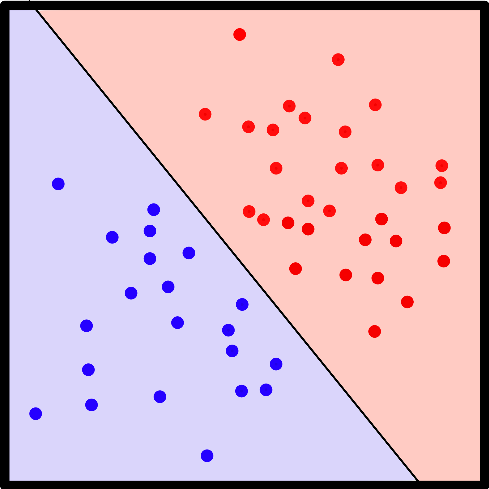

** Linear separability, generalized
- Generalizing to any $n$ dimensional space, sets of points are
  linearly separable if there is a hyperplane that separates them.
- In the language of convex hulls, two sets of points are linearly
  separable if their convex hulls are disjoint.

** Linear separability, formal definition
\begin{definition}
For sets of points $X_0$ and $X_1$ in some $n$ dimensional Euclidean
space, $X_0$ and $X_1$ are linearly separable if there are $n+1$ real
numbers $\vec{w} = (w_i)_{i\in[1,n]}$ and $k$, such that for all
$\vec{x} \in X_0$, $\vec{x} \cdot\vec{w} > k$ and for all $\vec{x} \in
X_1$, $\vec{x} \cdot \vec{w} < k$.
\end{definition}

** Linear separability of Boolean functions
A Boolean function $f : \{0, 1\}^n \to \{0, 1\}$ is linearly separable
if the hypercube of dimension $n$ with vertices assigned to outputs of
the function is linearly separable.
[[./images/bool_lin_sep.pdf]]

** Linear Classifiers
- A linear classifier is a function that, given two sets of data and a
  new data point, decides which set the data point belongs to.
- Given a vector of weights $\vec{w}$ and a feature vector $\vec{x}$,
  the classifier computes an output score $y$, given by
  $$y = f(\vec{w} \cdot \vec{x})$$
- Typically $f$ is a threshold function, which is simply a
  unit step function shifted by $\theta$:
  $$f(\vec{w}\cdot\vec{x}) = \begin{cases}1, & \vec{w}\cdot\vec{x} > \theta\\0, & \text{otherwise} \end{cases}$$

** Perceptrons
- A perceptron is a /learning/ linear classifier.
- It outputs a classification, but also uses the /correct/
  answer to update the weight vector $\vec{w}$.
- It can be viewed as an artificial neuron whose activation function
  is the unit step function.
#+ATTR_LATEX: :width 0.4\textwidth
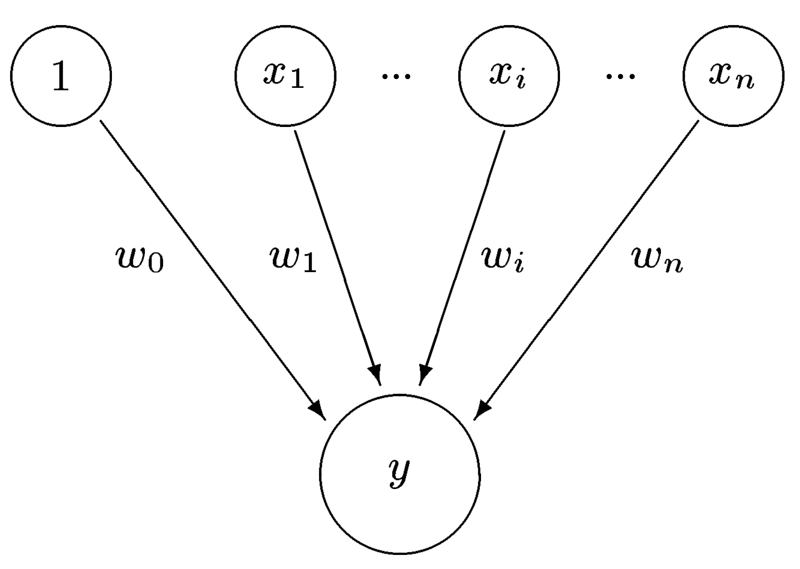

* Overview of Branch Prediction

** Pipelining Requires /Prediction/
- Imagine a conditional branch instruction enters the pipeline.
- Until we figure out whether to branch (this requires going through a
  couple of pipeline stages...) what do we do?
- We can stall, but that's wasteful.
- Better to "predict" which way the branch will go to figure out where
  to issue next instructions from.

** Ways to Predict
- "Static": always predict branches are taken (or untaken). Or some
  other static scheme, like always take backward branches, never
  forward branches, etc. etc.
- "Random": flip a coin to decide whether to take the branch. Makes
  timing nondeterministic.
- "Dynamic": much better, learns with the program at runtime.

** Dynamic Methods: One Level Saturating Counters
- One level, one bit: record the last outcome of the branch, assume
  the next one will go the same way.
- One level, two bit saturating counter.
  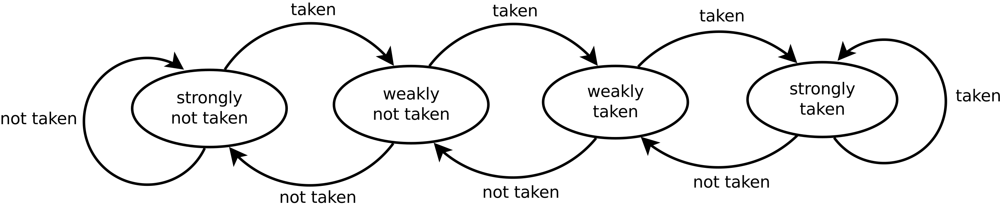
- Better since /two/ branches that go the other way are required to
  change state.

** One-Level Indexing
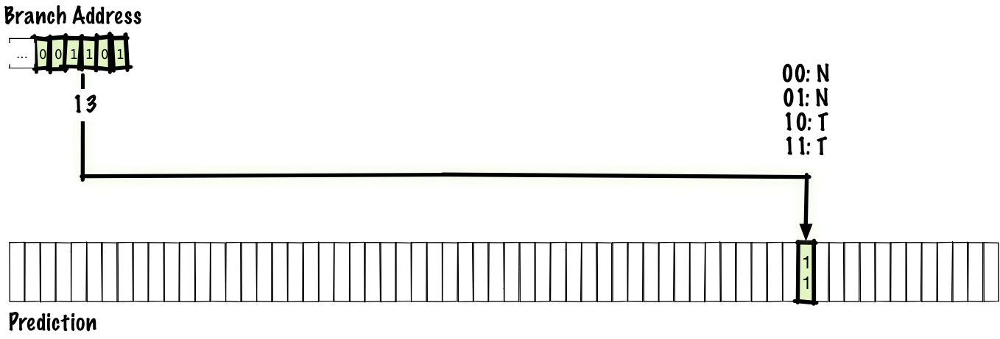

- There's a table of predictions indexed by the address of the
  instruction for predicting each branch.[fn:1]

** Dynamic Methods: Two Level Local
- Key idea is to catch repeating patterns of branches, for example:
  =100100100100=...
- Requires remembering the past $n$ directions of the branch.
- Have $2^n$ two bit saturating counters per branch, one for each
  possible history pattern (it'll be in $\{0, 1\}^n$).

** Two Level Local Diagram
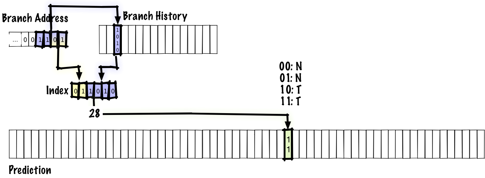[fn:2]

** Local vs. Global Prediction
- Local: maintain a history for each individual branch instruction.
- Global: use a /global/ history table instead of one local to each
  branch.
  - If branch directions are correlated with each other, performs
    better, else caused contamination between branches.

** Two Level Global Diagram (=gselect=)
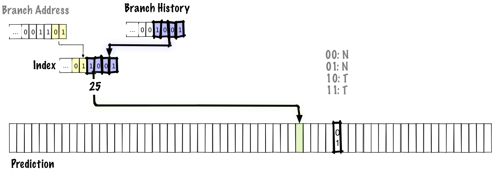[fn:3]

** gshare
- =gselect=, for a fixed-size prediction table, makes you choose
  between the number of branch PC bits and the number of global
  history bits.
- Want both: low interference between branches, and long histories to
  catch complex patterns.
- To get both, use =gshare=: hash them together with an XOR.

** =gshare= Diagram
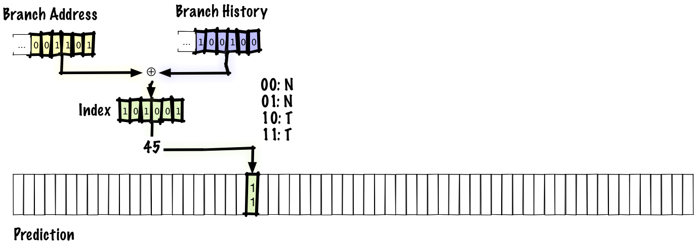

** Hybridization (McFarling predictors)
- Have multiple prediction mechanisms.
- Pick the predictor that's made
  the best predictions in the past. (meta-prediction)
- Or use a majority function on predictor outputs.

** Lots of other schemes...
- Many schemes attempt to reduce destructive interference due to
  branch aliasing.
- Others do more involved things.
- bi-mode, gskew, YAGS, TAGE...
- Today, we'll talk about a perceptron-based prediction mechanism.

** Key Insight: Branch Prediction is a Boolean Function
- The paper shows that perceptrons can be successfully used to learn
  certain branches.
- ...with a low hardware overhead.
- Note that a primary limitation of perceptrons is that they can only
  learn linearly separable functions (i.e., a perceptron couldn't
  correctly learn the XOR function).

* The Paper

** Citation
D.A. Jimenez and C. Lin, "Dynamic branch prediction with perceptrons,"
/Proceedings HPCA Seventh International Symposium on High-Performance
Computer Architecture/, Monterrey, Mexico, 2001, pp. 197-206, doi:
10.1109/HPCA.2001.903263.

** Background
- When this paper came out (2001), the field was focusing on
  eliminating aliasing in two level schemes (preventing destructive
  interference between unrelated branches).
- This paper aimed to improve the accuracy of the prediction itself,
  by replacing the two-bit saturating counters with perceptrons.

** Issue with standard two-level predictors: limited history depth
- The depth of the history buffer $D$ is related to the number of
  counters $C$ as: $2^D \leq C$ (recall the history pattern acts as
   an index into the array of counters).
- As we require longer history depths to catch correlated branches
  with large (temporal) gaps, the counter arrays become prohibitively
  large.
- Longer history lengths also require longer training times for such
  schemes.

** Why Perceptrons?
- Easy hardware implementation.
- Very easy to understand the decisions they make: just look at the
  weights vector (in contrast to general neural networks).

** The Perceptron Used
- Recall a perceptron's output is given by
  $$y = \vec{w}\cdot\vec{x} = \sum_{i=0}^n x_iw_i$$
- The paper's perceptron restricts:
  - $w_i\in\mathbb{Z}$ for all $w_i$ -- the weight vector,
  - $x_i\in\{-1, 1\}$ for all $x_i$ -- the history vector, and
  - $x_0 := 1$
- The second property means that the perceptron input is /bipolar/:
  either *taken* or *not taken*.
- The sign of output $y$ predicts the branch direction.

** Training the Perceptron
- Once output $y$ is generated, let $t=\pm 1$ be the actual result of
  the branch (negative means not taken).
- With threshold $\theta$, here's the training algorithm:

   #+BEGIN_SRC python :results output :exports code
     if sgn(y) != t or abs(y) <= theta:
         for i in range (0, n + 1):
             w[i] = w[i] + t*x[i]
   #+END_SRC

- That is, each =w[i]= is incremented if =x[i]= agreed with the true
  outcome, and decremented otherwise.

- Positive correlation means a larger weight, negative correlation
  means a larger negative weight, no/weak correlation means a weight
  near zero, and contributes less to outputs $y$.

** Overall Algorithm
- Get an index into the array of perceptrons:
    #+BEGIN_SRC python :results output :exports code
      idx: int = hash(branch_address)
    #+END_SRC

- Index into the array and get the perceptron (the weight vector):
    #+BEGIN_SRC python :results output :exports code
      w: list[int] = perceptron_array[idx]
    #+END_SRC

** Overall Algorithm
- Take the dot product of the global history register and =w=:
    #+BEGIN_SRC python :results output :exports code
      y: int = dot_product(w, [1] + global_history)
    #+END_SRC

- Make prediction based on sign of =y=:
    #+BEGIN_SRC python :results output :exports code
      prediction: bool = False if y < 0 else True
    #+END_SRC

** Overall Algorithm
- Once we have the actual result $t$, update $w$:
   #+BEGIN_SRC python :results output :exports code
     update_weights(w, t)
   #+END_SRC

- Write back $w$ to the table:
   #+BEGIN_SRC python :results output :exports code
     perceptron_array[idx] = w
   #+END_SRC

** Global v. Local AKA Why the =[1] +=
- The vector $\vec{x}$ is a vector of length $n+1$ that holds the global
  history in =x[1:]=.
- Note ~x[0] == 1~ is always true, so ~w[0]~ learns the bias of that
  specific branch independent of the global history.

** Block Diagram
#+ATTR_LATEX: :width 0.5\textwidth
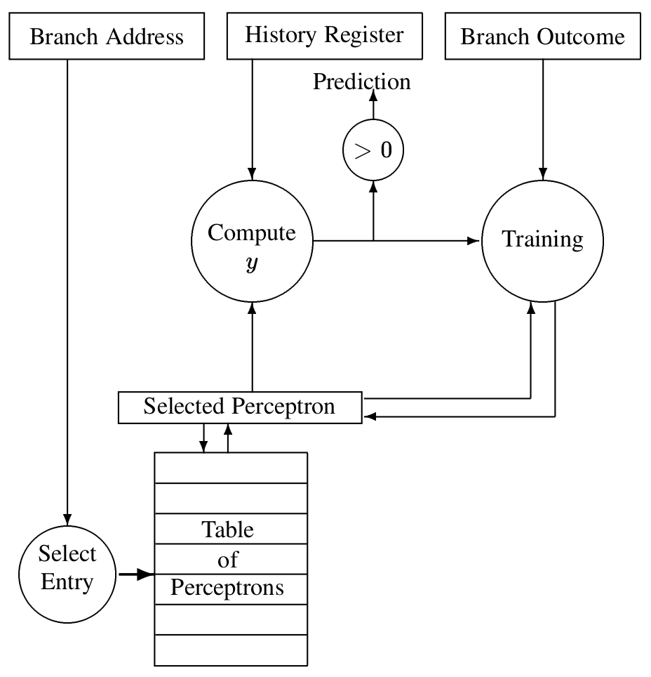

** Microarchitecture: Dot Product
- The real "computation" bits are the dot product and the "training"
  update to the weights (9 bits).

- Dot product:
  - Don't need multiplication, since the history vector elements are all
    in $\{-1, 1\}$.
  - Just add =w[i]= if =x[1]= is 1, else subtract. This is very
    similar to how a digital multiplier works.

    # TODO: Understand this point properly.
  - Paper estimates delay using a $54\times 54$ bit multiplier with a
    $0.25\mu\mathrm{m}$ process, concludes this operation can be done in 2
    cycles of a 700MHz clock.

  - Also, we only need the sign bit to make the prediction, so others
    bits can be computed more slowly.

** Microarchitecture: Training
- Training can be done bit-parallely since we increment =w[i]= if
  =x[i]= was right, else decrement.
- The paper sets each weight to 9 bits, so the increment/decrement is
  also quick.

** Parameter Space
Assuming a fixed hardware budget,
- History length: greater length means better prediction but more
  aliasing since each table entry is larger.
- Representation of weights: could use FP, but signed integers are
  good enough here.
- Threshold $\theta$: This determines the largest possible output $y$,
  hence the largest possible weight $w_{i}$, and therefore the "size"
  of each perceptron table entry.

** Results
- This paper is very influential: lots of other papers are based on
  it, and perceptron-based branch predictors are used in Samsung's M1,
  AMD's Zen (and likely other AMD chips).
- Still, looking at methodology and experimental results is valuable.

** Compared Against
- =gshare=
- =bimode=: A kind of branch predictor designed to prevent destructive
  aliasing as much as possible.
- Show that a hybrid of =gshare= and the perceptron predictor has good
  performance since they have complementary strengths.

** Instrumentation
- Compiled programs w/gcc, ran on AMD K6-III under Linux.
- Instrumented the binaries so every branch called a trace-generation
  function.
- Took traces with information about branches and their directions and
  fed them to a branch predictor simulator.

** Benchmarks and Tuning
- SPEC 2000 integer benchmarks.
- ~100 million branch traces, equivalent to simulating roughly 0.5
  billion total instructions.
- Tuned all predictors by searching the parameter spaces for optimal
  values for various hardware budgets.

** Optimal History Lengths
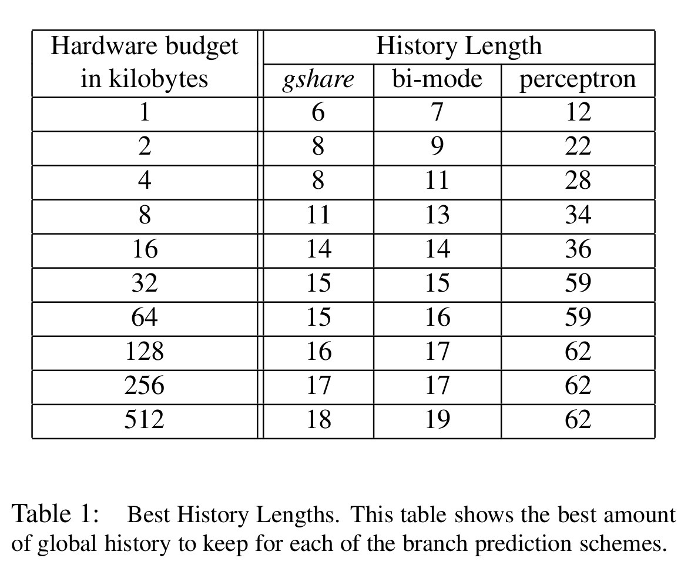

** On History Lengths
- Schemes like =gshare='s table sizes scale exponentially (as $2^N$)
  with the length of the history buffer.
- The perceptron predictor scales /linearly/ --- if you increase the
  size of your history buffer by 1, each perceptron needs 1 extra bit.
- This allows the perceptron predictor to look at far longer histories
  for the same hardware budget.

** Hardware Budget v. Misprediction Rate
#+ATTR_LATEX: :width 0.7\textwidth
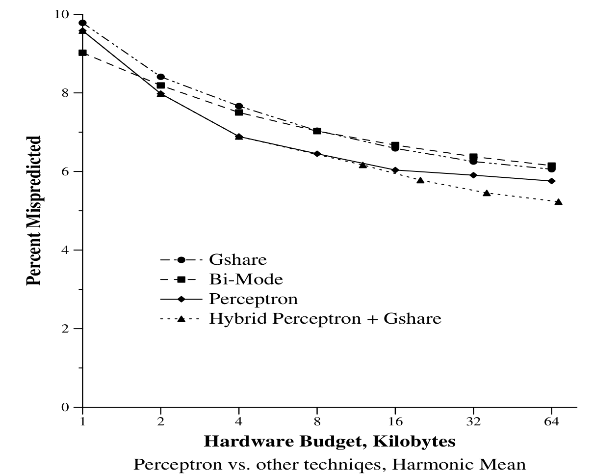

** Training Times: Perceptrons Learn Faster
#+ATTR_LATEX: :width 0.7\textwidth
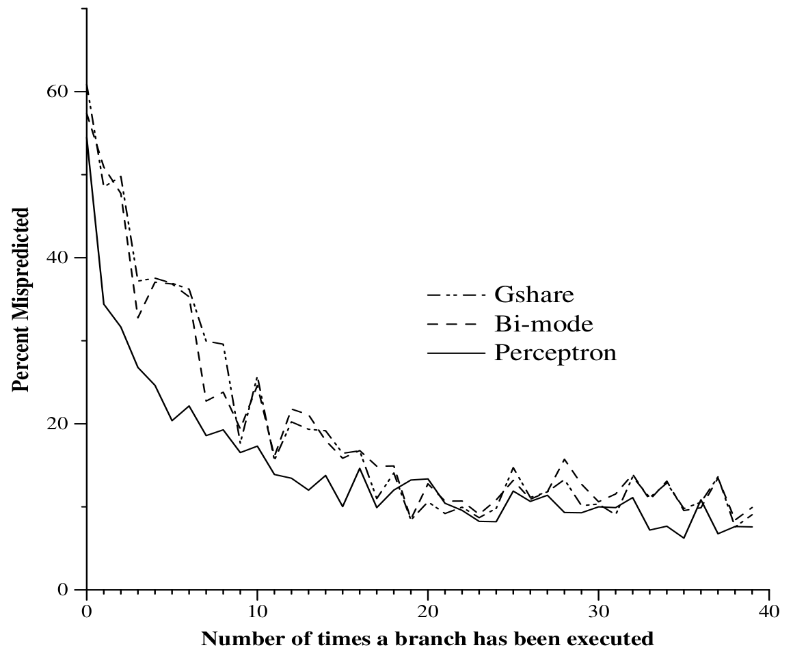

** Why Do Perceptrons Do Well?
- Main advantage is being able to use longer history lengths.
- When =gshare= and perceptron use histories of the same length,
  =gshare= outperforms perceptron due to:
  - Destructive aliasing in perceptron
  - =gshare= can learn non linearly separable Boolean functions.

** History Length v. Misprediction
#+ATTR_LATEX: :width 0.5\textwidth
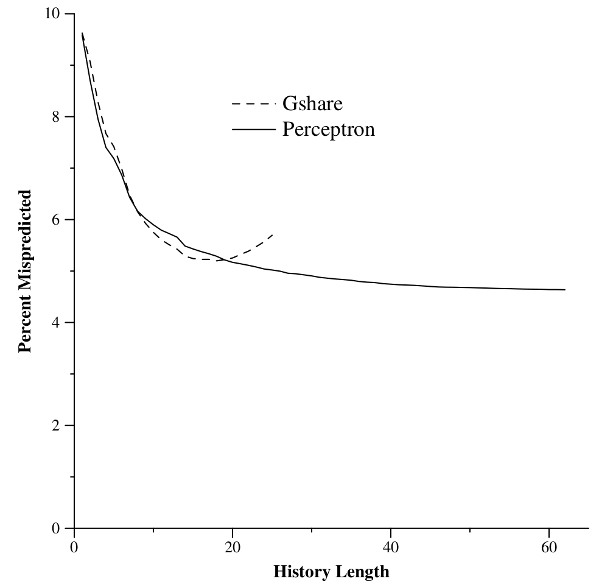

** When Does it Do Well
- For $n$ bits of history, a static branch $B$, and a history vector
  $h_n$, let $f_B(h_n)$ be the Boolean function that best predicts
  $B$.
- If $f_B$ is not linearly separable, then =gshare= will usually
  outperform the perceptron.
- ...unless the branch requires long histories to be accurately
  predicted. Then, the perceptron predictor still does better.

** Additional Advantages
- Output $y$ is also a confidence estimator --- if the confidence is
  low, the pipeline can be gated (as discussed in a SP23 meeting).
- The weight vector of the perceptron once trained can give data to
  other modules about branch correlation.

** That's All
Thanks for coming!

* Footnotes
[fn:4] Math majors: this is an oversimplification, since this is only
true for the special case of coordinate spaces...vectors in general
don't need to be "lists".

[fn:1] Image credit: https://danluu.com

[fn:2] Image credit: https://danluu.com

[fn:3] Image credit: https://danluu.com
