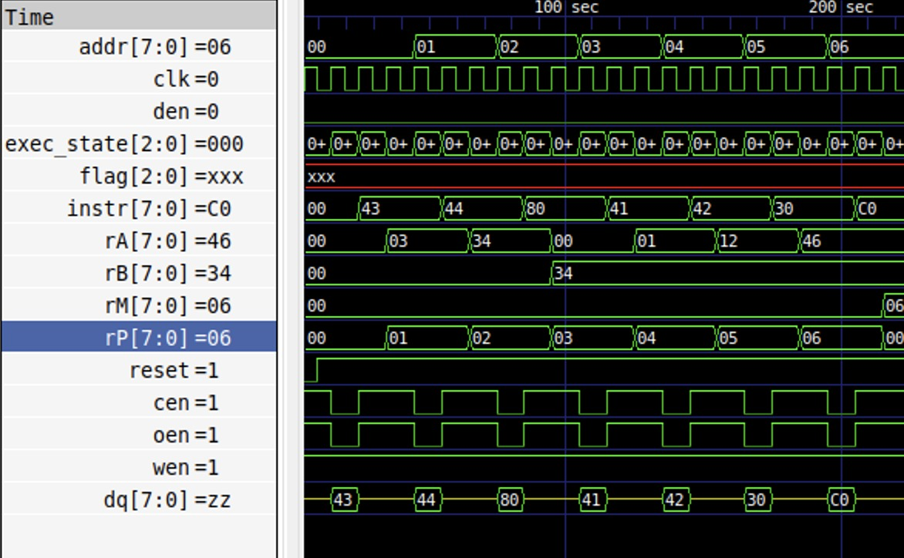
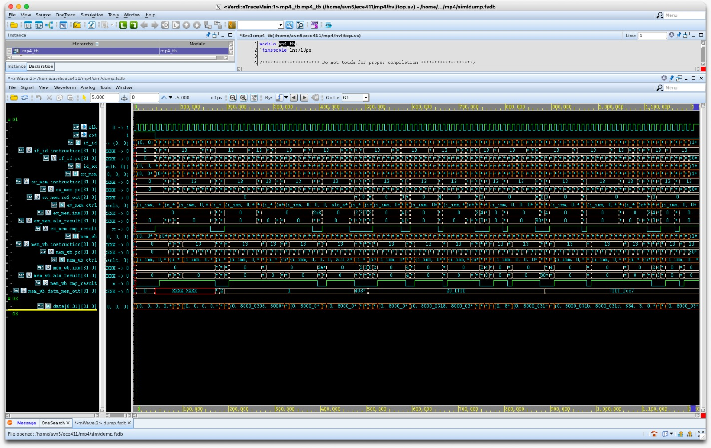

#+title: An Introduction to SystemVerilog
#+options: toc:nil
#+subtitle: SystemVerilog Series
#+date:
#+author: =@nebu=
#+include: ./org_header.org

* Why SystemVerilog?
- Modern computers are typically implemented using digital
  electronic circuits.
- Implementing the microarchitecture of a computer requires
  a /description language/ for digital electronic circuits.
- Common hardware description languages (HDLs) are: Verilog,
  SystemVerilog, VHDL.

* Levels of Abstraction
- How can we describe a digital circuit? In terms of:
  - Individual transistors.
  - Individual gates.
  - ...?
  - Architectures/algorithms (think Tomasulo's)
- Problem: gates/transistors are too low level, algorithms are too
  high level to "synthesize" into circuits.

* Enter Register Transfer Level
- RTL models digital circuits at the level of registers, and the flow
  of data (signals) between them.

- Informally, an RTL circuit is typically described as a system made
  of two kinds of components:
  - Registers (D flip-flops)
  - Combinational logic

- The combinational logic connects registers together, doing binary
  operations on the signals flowing through it.

* RTL Circuit

\tiny Alinja at the English Wikipedia, CC BY-SA 3.0
<http://creativecommons.org/licenses/by-sa/3.0/>, via Wikimedia
Commons

* Back to SystemVerilog
- SystemVerilog can be used for RTL design (that gets /synthesized/
  into (a netlist of) gates).
- It can also be used for gate-level and "switch-level"[fn:1] modeling.
- SystemVerilog is also used for /verifying/ that the
  described circuit works as intended by /simulating/ its operation.
- ...so it's a complicated language with many features.

* History Lesson
- Verilog (portmanteau of \textbf{veri}fication and \textbf{log}ic) was invented in the
  early 80s, through an acquisition became Cadence's IP, then was made
  into an open standard (IEEE 1364-1995).
- Updated to IEEE 1364-2001, then IEEE 1364-2005.
- Meanwhile, Accelera was working on a superset of Verilog:
  SystemVerilog. Languages were merged in IEEE 1800-2009.
- Updated to IEEE 1800-2012, then IEEE 1800-2017 (*current*).

* How is it used?
- SystemVerilog is widely used for verification. UVM (an open source
  class library) is also used for verification.

- Synthesizable RTL is often still pure Verilog, since toolchains are
  slow to support new features, and correctness over novelty is
  important.

* Simulation
- In an ASIC context, taping out a chip is expensive. Before taping
  out a design, it's important to make sure it'll work as expected.

- A simulator is a software tool that "runs" your design as a software
  simulation, before it's in actual hardware.

* HDLs are not programming languages
- SystemVerilog looks a lot like C or C++. This is deceiving, since
  the languages are very different.

- HDLs are modeling languages, as such, they include an explicit
  notion of time, with multiple events logically happening
  simultaneously.

- Simulators use queue-based timekeeping algorithms to track the state
  of various parts of the design as it moves forward through
  simulation time.

- A graphical view of this is called a "waveform", a graph of signal
  values with respect to time.

* Small Waveform

* Ugly Waveform --- Hence Verification

* Commercial Tooling: The Big Three
- The "big 3" simulators are:
  - Synopsys VCS
  - Cadence Incisive/NC-Verilog/Xcelium
  - ModelSim/Questa
- Open source simulators:
  - Icarus Verilog (=iverilog=)
  - Verilator
- Synthesis tools vary by technology.
- Site for trying tooling: https://www.edaplayground.com/.

* Let's wrap it up
- Truly learning computer architecture will eventually mean implementing digital
  electronic circuits in an HDL.
- SystemVerilog is the HDL of choice at SIGARCH and UIUC ECE.
- SystemVerilog can be used for both design and verification.
- There are a huge variety of language constructs, tools,
  methodologies, design patterns, etc. in RTL design and verification:
  it's a broad and difficult field.
- It's also extremely rewarding and fun!

* Oh, and that other HDL...
- VHDL -- VHSIC (Very High Speed Integrated Circuits) Hardware
  Description Language.
  - Doesn't stand for Verilog HDL.
- Anecdotally, VHDL is used more in military, space, and Europe,
  whereas Verilog is used more in private companies and the US.

- For a more in-depth comparison, see:
  https://trilobyte.com/pdf/golson_clark_snug16.pdf.

[fn:1] An abstraction layer in between gates and analog transistors.
